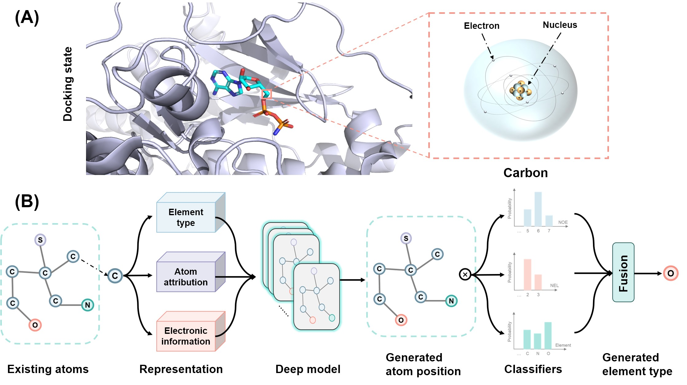
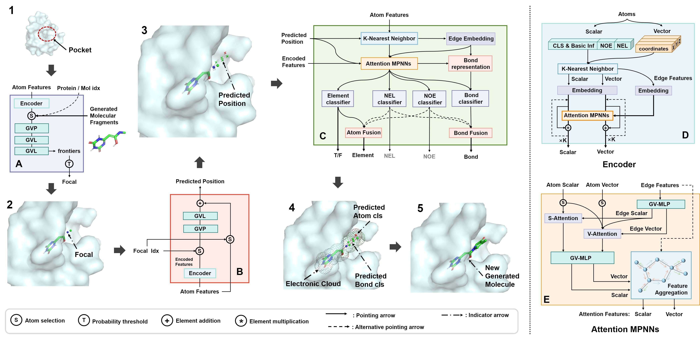

# APMG
APMG: 3D MG Driven by Atomic Chemical Properties



## Installation
**Update**: Now the codes are compatible with PyTorch Geometric (PyG) >= 2.0.
### Dependency
The codes have been tested in the following environment:
Package  | Version
--- | ---
Python | 3.8.12
PyTorch | 1.10.1
CUDA | 11.3.1
PyTorch Geometric | **2.0.0**
RDKit | 2022.03
BioPython | 1.79
<!-- OpenBabel | 3.1.0 -->
<!-- NOTE: Current implementation relies on PyTorch Geometric (PyG) < 2.0.0. We will fix compatability issues for the latest PyG version in the future. -->
### Install via conda yaml file (cuda 11.3)
```bash
conda env create -f env_cuda113.yml
conda activate APMG
```

### Install manually

``` bash
conda create -n APMG python=3.8
conda activate APMG

# Install PyTorch (for cuda 11.3)
conda install pytorch==1.10.1 cudatoolkit=11.3 -c pytorch -c conda-forge
# Install PyTorch Geometric (>=2.0.0)
conda install pyg -c pyg

# Install other tools
conda install -c conda-forge rdkit
conda install biopython -c conda-forge # used only in sample_for_pdb.py
conda install pyyaml easydict python-lmdb -c conda-forge

# Install tensorboard only for training
conda install tensorboard -c conda-forge  
```

## Datasets

Please refer to [`README.md`](./data/README.md) in the `dataset` folder.

## Sampling

To sample molecules for the i-th pocket in the testset, please first download the trained models following [`README.md`](./ckpt/README.md) in the `ckpt` folder. 
Then, run the following command:

```bash
python sample.py --data_id {i} --outdir ./outputs  # Replace {i} with the index of the data. i should be between 0 and 99 for the testset.
```

## Training
```
python train.py --config ./configs/train.yml --logdir ./logs
```
